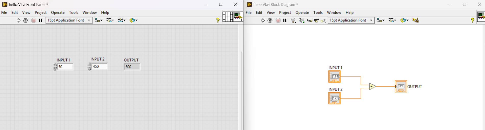
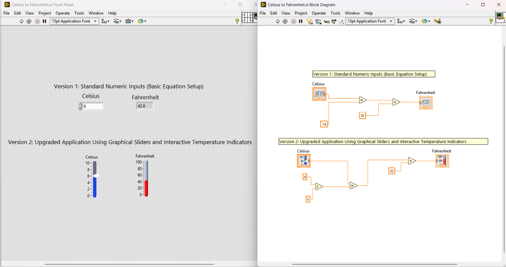
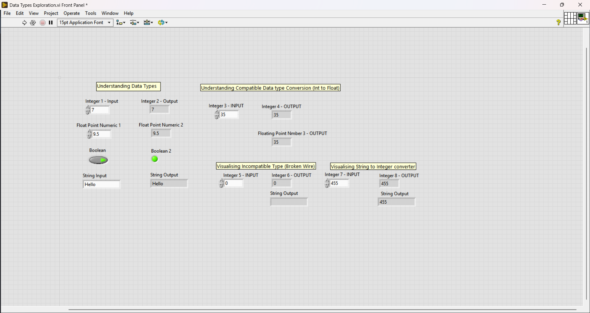
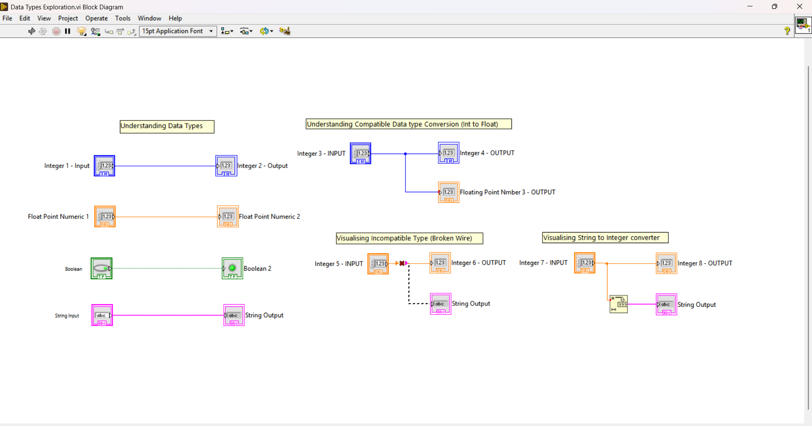

# SpectraGaze Systems — Engineering Internship Portfolio

This repository hosts development deliverables, environment validations, and graphic dataflow applications completed during the engineering onboarding training track.

---

## 📁 Day 1 Tasks & Labs

### 🚀 Task 1: Onboarding & Environment Setup
* **Objective:** Install LabVIEW 2026 Q3 (Community Edition), configure NI-DAQmx and NI-VISA drivers, and verify activation in NI Package Manager.

#### Deliverables:
- Verified installation of LabVIEW + drivers
- Repo cloned successfully

---

### 🚀 Task 2: Graphic Dataflow Foundations ("Hello VI")
* **Source File:** `Hello VI.vi`
* **Objective:** Design an introductory visual pipeline to accept distinct user inputs, execute dynamic arithmetic calculations, and update front-panel indicators safely.

#### System Execution Layout:

---

### 🚀 Task 3: Mathematical Function Conversions (Temperature Converter)
* **Source File:** `Celsius to Fahrenheit.vi`
* **Objective:** Implement physical formulaic scaling logic to dynamically map temperature shifts across fractional integer paths, using intuitive UI elements.

#### Logic & Layout:
- Added a **vertical slider** for Celsius input to make temperature selection more interactive.  
- Used **Multiply (×)**, **Add (+)**, and **Divide (÷)** blocks to structure the conversion formula clearly.  
- Routed the result into a Fahrenheit indicator for live display.  
- Verified correctness (e.g., 100°C → 212°F).  

#### System Execution Layout:

---

## 📁 Day 2 Tasks & Labs

### 🚀 Task 1: Core Data Types & Strict Typing Exploration
* **Source File:** `Data Types Exploration.vi`
* **Objective:** Verify operational behavior across standard memory primitives and demonstrate compilation enforcement under LabVIEW's strictly typed visual architecture.

#### Architectural Implementations:
1. **Compatible Type Scaling:** Demonstrates data promotion layers running an Integer (`I32`) pipeline cleanly into a Floating-Point (`DBL`) register path.  
2. **Strict Type Enforcement:** Intentionally highlights a type-mismatch compilation block (broken wire) when attempting to route raw Integer structures into text String outputs.  
3. **Explicit Type Casting:** Implements a baseline structural converter node to cleanly serialize numeric data into active text streams safely.

#### System Execution Layouts:

| Front Panel User Interface | Backend Block Diagram Dataflow |
| :---- | :---- |
|  |  |

