# SpectraGaze Systems — Engineering Internship Portfolio

This repository hosts development deliverables, environment validations, and graphic dataflow applications completed during the engineering onboarding training track.

---

## 📁 Day 1 Tasks & Labs

### 🚀 Task 1: Onboarding & Environment Setup
* **Objective:** Install LabVIEW 2026 Q3 (Community Edition), configure NI-DAQmx and NI-VISA drivers, and verify activation in NI Package Manager.

#### Deliverables:
- Verified installation of LabVIEW + drivers
- Repo cloned successfully

---

### 🚀 Task 2: Graphic Dataflow Foundations ("Hello VI")
* **Source File:** `Hello VI.vi`
* **Objective:** Design an introductory visual pipeline to accept distinct user inputs, execute dynamic arithmetic calculations, and update front-panel indicators safely.

#### System Execution Layout:

---

### 🚀 Task 3: Mathematical Function Conversions (Temperature Converter)
* **Source File:** `Celsius to Fahrenheit.vi`
* **Objective:** Implement physical formulaic scaling logic to dynamically map temperature shifts across fractional integer paths, using intuitive UI elements.

#### Logic & Layout:
- Added a **vertical slider** for Celsius input to make temperature selection more interactive.  
- Used **Multiply (×)**, **Add (+)**, and **Divide (÷)** blocks to structure the conversion formula clearly.  
- Routed the result into a Fahrenheit indicator for live display.  
- Verified correctness (e.g., 100°C → 212°F).  

#### System Execution Layout:

---

## 📁 Day 2 Tasks & Labs

### 🚀 Task 1: Core Data Types & Strict Typing Exploration
* **Source File:** `Data Types Exploration.vi`
* **Objective:** Verify operational behavior across standard memory primitives and demonstrate compilation enforcement under LabVIEW's strictly typed visual architecture.

#### Architectural Implementations:
1. **Compatible Type Scaling:** Demonstrates data promotion layers running an Integer (`I32`) pipeline cleanly into a Floating-Point (`DBL`) register path.  
2. **Strict Type Enforcement:** Intentionally highlights a type-mismatch compilation block (broken wire) when attempting to route raw Integer structures into text String outputs.  
3. **Explicit Type Casting:** Implements a baseline structural converter node to cleanly serialize numeric data into active text streams safely.

#### System Execution Layouts:
- **Front Panel User Interface:** 
- **Backend Block Diagram Dataflow:** 

---

### 🚀 Task 2: Linear Ramp Calibration Engine
* **Source File:** `Ramp Calibration Logic.vi`
* **Objective:** Synthesize sequential loop operations, arithmetic scaling factors, and multi-branch case structures to generate a software-calibrated ramp signal with active boundary checking.

#### Architectural Implementations:
1. **Data Domain Translation:** Maps raw incremental loop indices (`I32`) down to precise fractional data bounds (`DBL`) via linear feature-scaling multipliers (`× 0.1`).
2. **Active Exception Monitoring:** Hooks a comparative boolean branch into an independent `If/Else` Case Structure framework to toggle critical front-panel warning indicators the moment boundaries cross safety limits (`> 5.0`).
3. **Resource Optimization:** Integrates a localized **Wait (ms)** block to protect the CPU from processing spikes.

#### System Execution Layout:
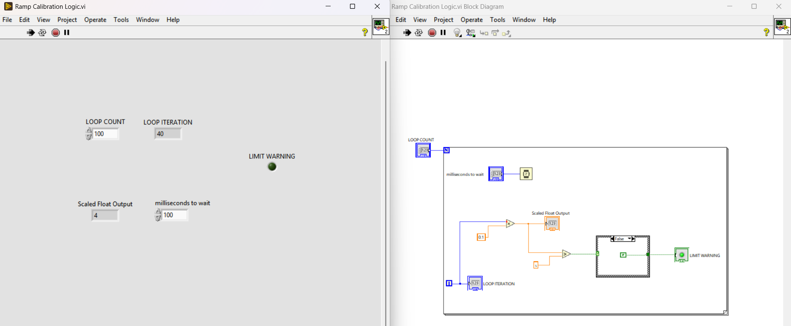
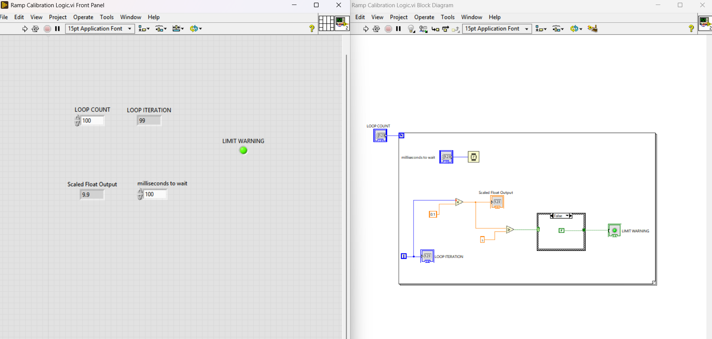

---

### 🚀 Task 3: Geometric Specification Matching (Area & Perimeter)
* **Source File:** `Area and Perimeter Calculator.vi`
* **Objective:** Recreate a specified arithmetic block diagram handling simultaneous geometric algebraic formulas based on linear user controls.

#### Layout Details:
1. **Area Pipeline:** Formulates a straight product map ($w \times h$) driven to the designated indicator node.
2. **Perimeter Pipeline:** Branches inputs into an introductory summation stage ($w + h$), passes the result downstream to a hardcoded constant multiplier factor (`2`), and updates the boundary display.

#### System Execution Layout:
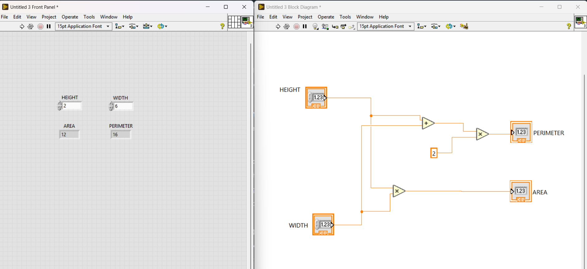

---

## 📁 Day 2 Self-Paced Advanced Extensions

### 🚀 Extension 1: Continuous Operational Loops
* **Source File:** `Understanding Loops.vi`
* **Objective:** Upgrade the static calculation pipeline by wrapping it inside an execution **While Loop** framework to process user inputs continuously without manual program restarts.

#### Architectural Implementations:
- Placed an active execution container that keeps the script alive until an explicit condition is met. 
- Wired a front-panel mechanical **STOP Button** straight into the red loop conditional terminal to release CPU threads safely upon user termination.

#### System Execution Layout:
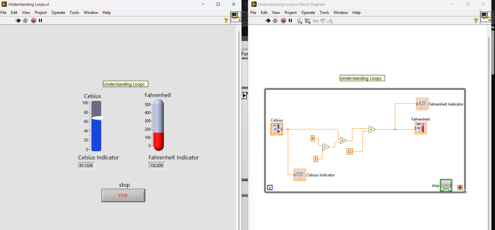

---

### 🚀 Extension 2: Multi-Branch Logical Scaling
* **Source File:** `Understanding Case Structure.vi`
* **Objective:** Integrate a deep architectural branch condition using an interactive switch to toggle backend mathematical calculation paths dynamically.

#### Architectural Implementations:
- Placed a **Mechanical Toggle Switch (Boolean Control)** and routed its green signal line directly to the frame selection terminal of a **Case Structure**.
- When set to `True`, the program executes the baseline temperature formula pipeline cleanly. When toggled, alternative structural branches are activated to handle fallback logic paths safely.

#### System Execution Layout:

---

### 🚀 Extension 3: Array Primitive Matrices & Index Interrogation
* **Source File:** `Understanding Arrays.vi`
* **Objective:** Design an advanced memory exploration canvas to verify how composite collection data paths handle bundled variables, size metrics, and localized position extractions.

#### Architectural Implementations:
1. **Parallel Type Grouping:** Grouped separate homogeneous data vectors for both **Numeric Arrays** (Orange thick wires feeding vertical graphs) and **Boolean Arrays** (Thick green wires driving multi-LED indicators).
2. **Data Extraction Nodes:** Deployed the **Array Size** function node to automatically calculate total data density (`Size = 4`) and the **Index Array** function node to scan registers and isolate a single variable item out to an independent display.

#### System Execution Layout:
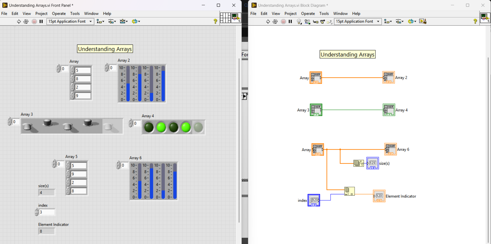

---

## 📁 Day 3 Tasks & Labs

### 🚀 Dataflow Programming Models & Execution Concurrency
* **Source File:** `Understanding DataFlow.vi`
* **Objective:** Map structural node execution, trace independent thread processing, and eliminate structural Flat Sequence boxes using pure wire data dependency tracking and functional selection gates.

#### 🎥 Video Knowledge Validation:
* **Fahrenheit to Celsius Study Tool:** Pre-lab diagnostic exploration verifying baseline data packet routing pipelines.
  * **System Visualization:** 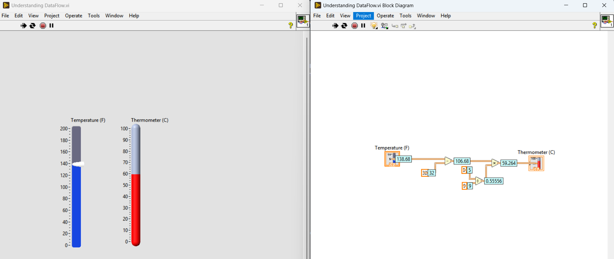

---

### 🚀 Task 1: Arithmetic Primitive Chaining & Flow Logic
* **Objective:** Map multi-stage mathematical expression chains to analyze how downstream computational nodes dynamically lock until initial wire inputs are completely satisfied.

#### System Execution Layouts:

| Front Panel User Interface | Backend Block Diagram Dataflow |
| :---: | :---: |
| 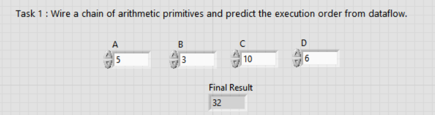 | 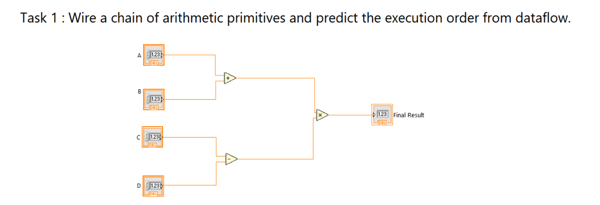 |

---

### 🚀 Task 2: Asynchronous Parallel Branches & Concurrency
* **Objective:** Deploy isolated calculation networks running side-by-side to demonstrate automatic compiler hardware multi-threading across separate CPU cores without manual thread handling routines.

#### System Execution Layouts:

| Front Panel User Interface | Backend Block Diagram Dataflow |
| :---: | :---: |
| 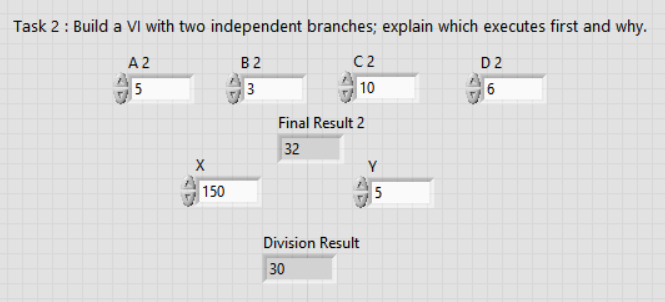 | 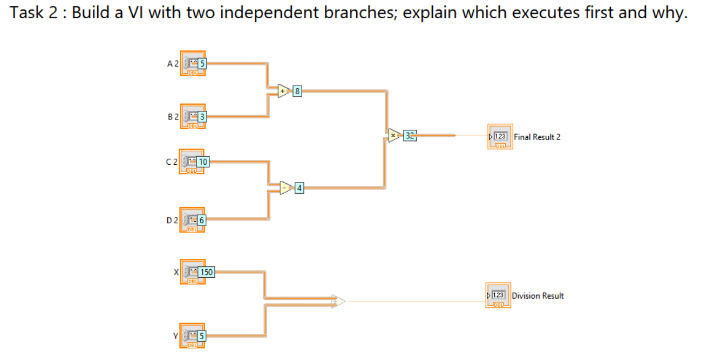 |

---

### 🚀 Task 3: Sequence Structure Refactoring & Optimization
* **Objective:** Model how text-based programmers artificially force timing controls using flat film-reel frames, and subsequently refactor the logic to run purely on data dependency constraints.

#### 1. Flat Sequence Architecture Framework (Baseline)
* **Execution Behavior:** Enforces sequential step logic by restricting frame execution chronologically from left to right. Frame 1 stays completely frozen and grayed out while data bubbles travel through Frame 0.

| Flat Sequence Panel Interface | Sequence Frame 1 Block View |
| :---: | :---: |
| 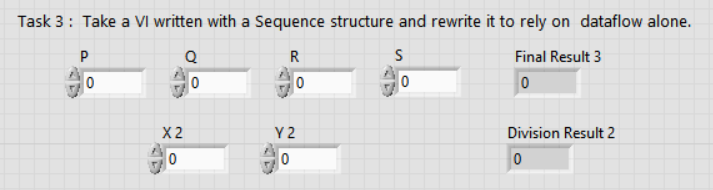 | 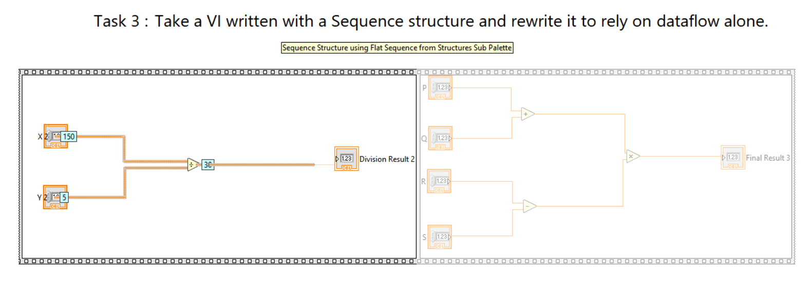 |

#### 2. Advanced Refactored Non-Destructive Pipelines
* **Execution Tracking Phase 1:** Demonstrates data flow monitoring under highlighted bubble routing paths.
  * **System Visualization:** 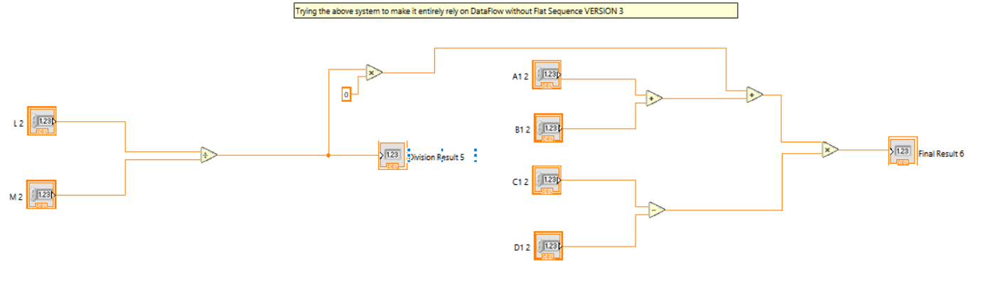
* **Execution Tracking Phase 2 (Selector Gate Function):** Utilizes a Select function block locked to an absolute **True** constant. The operational logic forces the system to freeze downstream multiplication steps until the asynchronous division data bubble finishes processing and arrives at the gate's lower terminal, preserving 100% mathematical integrity.
  * **System Visualization:** 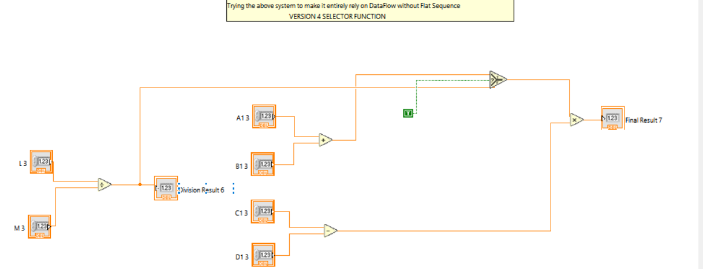

---

## 📁 Day 4: Core Environment Diagnostics & Subsystem Validation

### 🚀 Advanced Debugging Methodologies, Trace-Point Probing & Modular Engineering
* **Source Files:** Custom Sub-VI Geometry Module and Master Diagnostic Interface Canvas
* **Objective:** Master professional environment instrumentation, runtime thread interrogation, and multi-point parameter tracking by diagnosing compile-time syntax faults and correcting hidden semantic logic errors within a multi-VI application.

#### Detailed Architectural Implementations & Technical Milestones:

1. **Modular Sub-VI Architecture & Connector Mapping:**
   * Engineered a standalone geometric subsystem utilizing multi-input resizable calculation nodes to streamline block diagram workspace efficiency.
   * Mapped internal controls and indicators directly to the upper-right **Connector Pane Grid**, creating functional, external hardware terminals. This enables the top-level script to cleanly call and pass parameters to the module as a reusable function block.

2. **Real-Time Parameter Probing & Dynamic Value Logging:**
   * Configured floating **Wire Probes** across separate data buses on the block diagram, serving as virtual digital multimeters.
   * Utilized **Highlight Execution** to visually track the speed and path of data packets flowing through the circuits.
   * Activated **Retain Wire Values** mode to preserve system memory maps after program completion. Verified that the diagnostic window logged precise parameter values (`24`, `25`, and `3061.2`) along the wire paths during full-speed runtime.

3. **Execution Thread Control via Context Breakpoints:**
   * Deployed structural **Breakpoints** directly onto the called sub-VI icon node, establishing a physical thread-freeze boundary.
   * Verified that the breakpoint successfully halts background CPU execution the millisecond input data arrives, triggering a flashing red pause state on the toolbar ribbon. This allows developers to inspect static intermediate memory states calmly before the application proceeds.
   * Practiced micro-stepping execution commands (**Step Into**, **Step Over**, and **Step Out**) to advance data packets through the logic nodes one bubble at a time.

4. **Syntax & Semantic Bug Remediation:**
   * **Syntax Layer:** Analyzed compiler failures via the three-pane **Error List** window to instantly auto-locate an uncompiled, unwired pin on the sub-VI's division node. Fixed by linking a hardcoded constant denominator.
   * **Semantic Layer:** Troubleshooted a hidden runtime logic error where a side-length validation circuit permanently failed. Used wire probes to find that a Less Than (`<0`) comparator was incorrectly used instead of a Greater Than (`>0`) block. Swapping the operator allowed the resizable 3-input **AND** gate to fire the front-panel safety status LED perfectly.

#### Verified Implementation Workspaces:

| Active Trace-Point Probe Analysis | Execution Thread Boundary Interrogation |
| :---: | :---: |
| 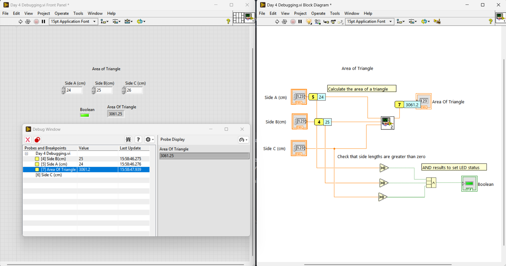 | 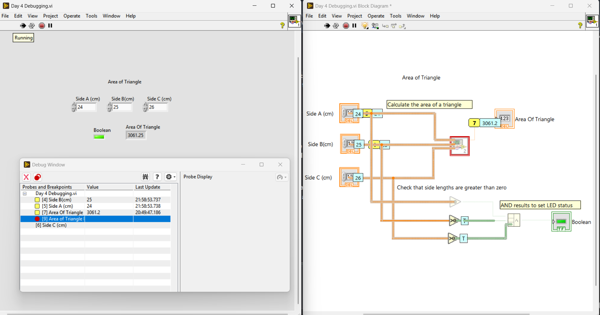 |

| Trace-Point Probes under Highlight Execution | Validation Status Optimization |
| :---: | :---: |
| 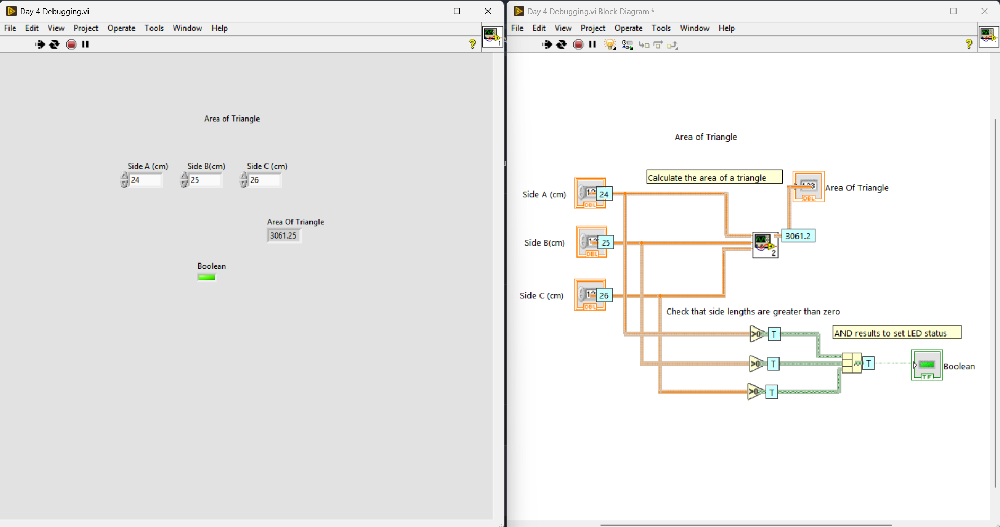 | 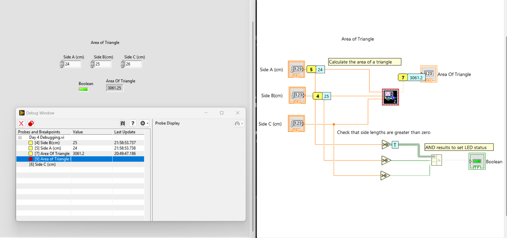 |

---

## 📁 Day 5: Multi-Primitive Interface Engineering & Data Type Calibration

### 🚀 Advanced Numeric Representation Alignment & Multi-Primitive User Interfaces
* **Objective:** Synthesize multiple data primitives (Numeric, Boolean, and String formats) into an integrated user interface canvas while executing precise numeric representation calibration to ensure optimal compiler processing efficiency.

---

### 📥 Implementation 1: Numeric Representation Calibration (Task [E])
* **Source File:** `Day 5 Mini UI and Type Calibration.vi`
* **Objective:** Isolate compile-time data conversion behavior by triggering and subsequently resolving memory coercion warnings.

#### Key Mechanics:
* **The Coercion Fault:** Wiring a 64-bit Floating-Point line (`DBL`) directly into a 32-bit Integer terminal (`I32`) forces an automatic run-time data conversion, throwing a red coercion dot anomaly at the target node.
* **The Optimization:** Modifying the block properties to ensure identical representations eliminates the coercion dot entirely, preventing background CPU overhead cycles.

#### System Calibration Layout:
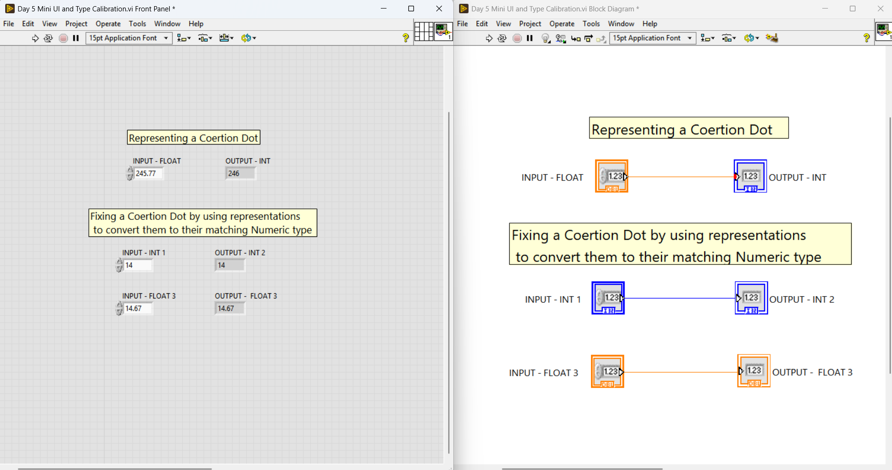

---

### 📥 Implementation 2: Primitive Variable Matrix (Task [M])
* **Source File:** `Day 5 Mini UI and Type Calibration.vi`
* **Objective:** Group all four core primitive data formats onto a single interface layout to confirm concurrent data bus streaming.

#### Integrated Tracks:
1. **Numeric Primitives:** Parallel color-coded wire paths for Blue Integers (`I32`) and Orange Double Floats (`DBL`).
2. **Boolean Matrix:** Mechanical push buttons and green status LED signaling lines.
3. **String Array:** Alphanumeric pink data paths routing keyboard text streams seamlessly.

#### System Workspace Layout:
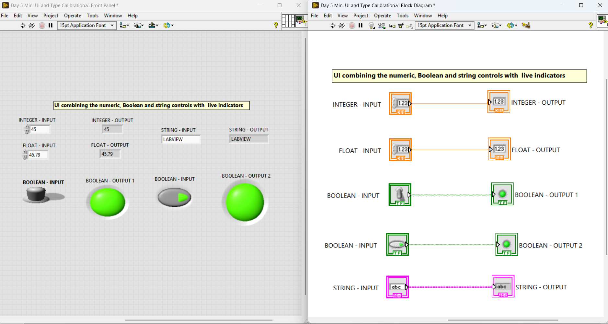

---

### 📥 Implementation 3: Industrial Human-Machine Interface (HMI) Console
* **Source File:** `DAY 5 Mini UI to Replicate Real System.vi`
* **Objective:** Scale multi-primitive data tracks into an integrated, theme-oriented diagnostic cockpit console using structural container frames and comparative trip automation.

#### Detailed Architectural Features:
* **Zoning Panels:** Utilizes recessed structural boxes to visually group the interface into independent instrumentation bays (Propulsion Telemetry, Flight Decision Matrix, and Subsystem Log Feeds).
* **Automated Safety Interlock:** Links an orange telemetry fuel line into a Less Than or Equal To ($\leq$) comparison gate mapped against a constant safety limit of `25`. The logic trips the warning indicator light the exact millisecond metrics drop to 25% or lower.

#### System Execution Layouts:

| Theme-Oriented Front Panel Dashboard Console | Backend Block Diagram Multi-Bus Pipelines |
| :---: | :---: |
| 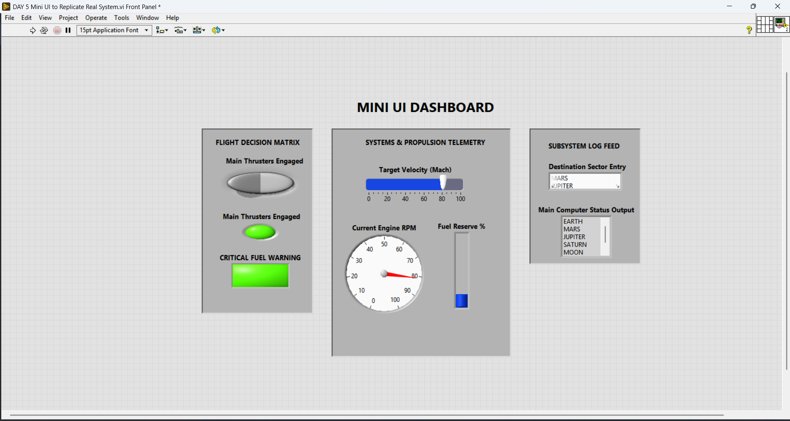 | 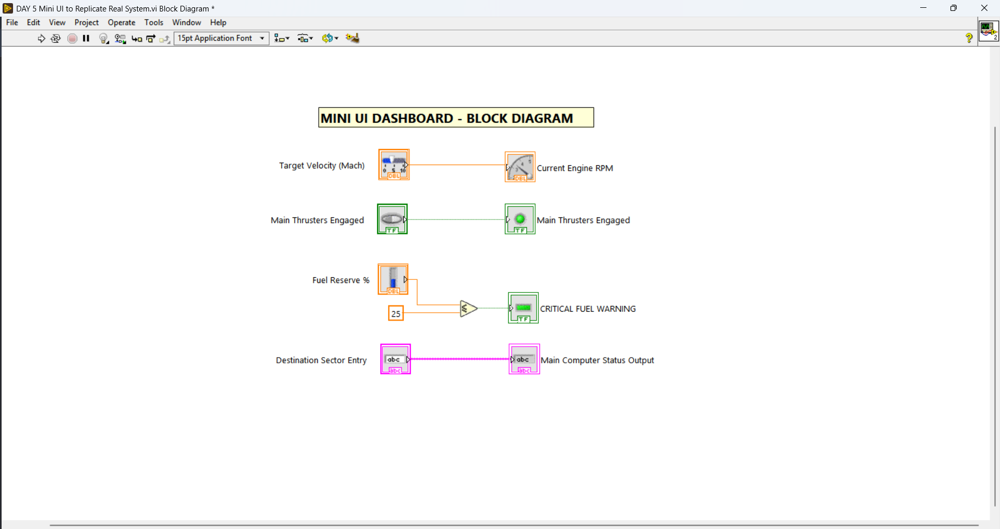 |

---

## 📁 Day 6: Iterative Loop Architectures & Multi-Dimensional Array Processing

### 🚀 Graphical Array Accumulation, Nested Loops & Multi-Method Logic
* **Source File:** `Day 6 Core Loop Exercises.vi`
* **Objective:** Master For Loop boundaries, automated auto-indexing array accumulation, and nested multi-axis matrix tracking while implementing and verifying multiple data routing methodologies.

#### Detailed Architectural Implementations & Technical Milestones:

1. **Automated Array Accumulation via Border Tunnels (Task):**
   * Explored how data boundaries capture scalar packets, eliminating the need to manually initialize memory slots or handle variable pointers.
   * Constructed an auto-indexing squaring loop executing a fixed count boundary ($N=10$) to dynamically assemble an ordered mathematical data array from $0^2$ to $9^2$.

2. **Multi-Axis Matrix Stacking via Nested Loops (Task):**
   * Engineered a dual-loop nested framework to dynamically generate a comprehensive $10 \times 10$ multi-dimensional multiplication spreadsheet chart.
   * Evaluated how horizontal row trays are compiled by inner loop terminals and subsequently stacked top-to-bottom by outer boundaries, changing wire types into double-line matrix grid formats.

3. **Identity Matrix Comparative Design Analysis (Task):**
   * **Methodology 1 (Programmatic Cast):** Paired an index Equality Comparator block with a highly efficient **Boolean to (0,1)** primitive function block to automatically translate state flags directly into binary integers ($1$ on matching coordinate intersections, $0$ everywhere else), establishing clean data dependency while removing visual diagram clutter.
   * **Methodology 2 (Explicit Selector Gate):** Implements a structural **Select function block** driven by explicit numeric constant blocks (`1` and `0`) to control the target pipeline matrix data paths cleanly, providing a clear visual representation of multi-branch logic tracking.

#### Verified Implementation Workspaces:

| 1D Auto-Indexing Squaring Loop Array | 2D Multi-Axis Multiplication Matrix Chart |
| :---: | :---: |
| 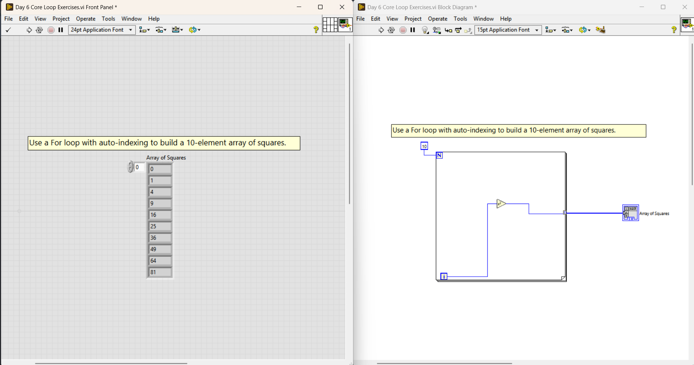 | 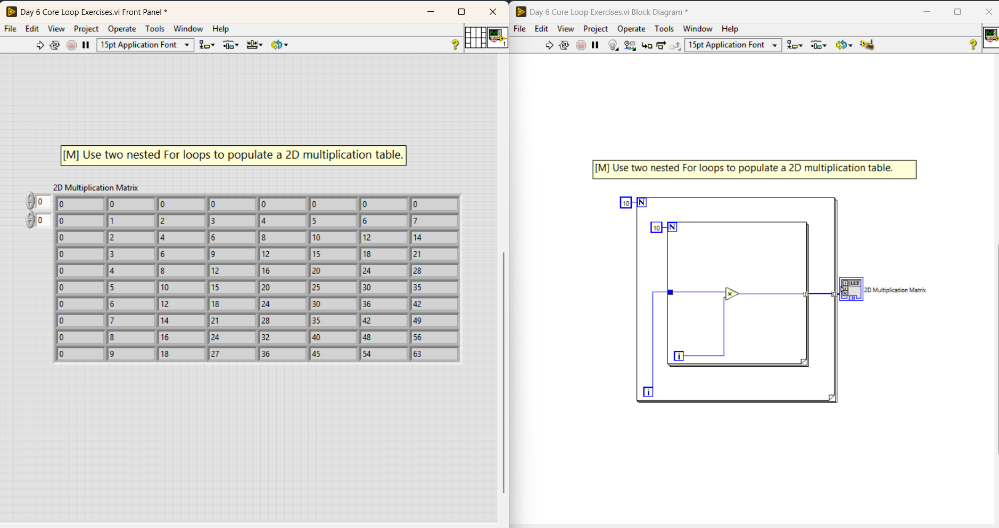 |

| Multi-Method Identity Matrix System Architecture |
| :---: |
| 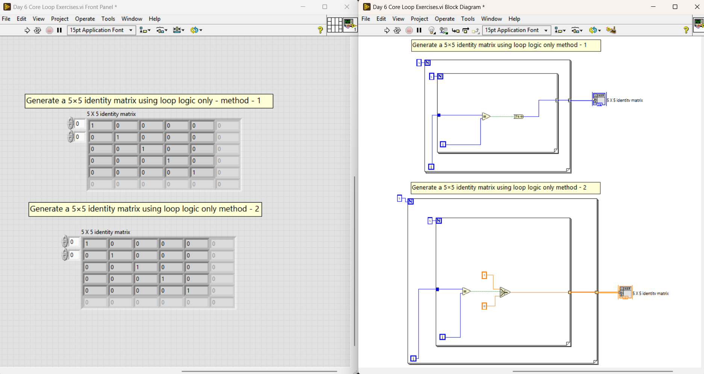 |

---

## 📁 Day 7: Feedback Loop Memories & Multi-Iteration Deep Registries

### 🚀 Shift Register Feedback Architectures, Signal Smoothing Filters & Mathematical Engines
* **Objective:** Master programmatic loop feedback memory channels, multi-level deep historical database structures, and multi-point sequence seeding rules to pass data parameters dynamically between consecutive execution cycles.

#### Detailed Architectural Implementations & Technical Milestones:

1. **Modular Code Replication & Behavior Analysis:**
   * Explored foundational shift register mechanics across discrete execution panels, validating basic initialization anchors, multi-loop tracking, and polymorphic data-type adaptability across integer and floating-point registers.

2. **Automated Feedback Loop Accumulators:**
   * Developed a continuous, non-destructive mathematical accumulator running inside an independent execution loop framework.
   * Anchored a single-level feedback register initialized to a baseline parameter constant of `0` to wipe stale background memory caches on every startup launch, calculating an accurate cumulative tracking matrix.

3. **Multi-Level Stacked Register Moving Average Filters:**
   * Expanded a loop boundary interface into a 4-level deep **Stacked Shift Register** array ($n-1$ through $n-4$) serving as a sliding memory database window.
   * Engineered a real-time signal smoothing noise filter that aggregates incoming data traces, computes their rolling arithmetic mean, and outputs a smoothed numerical data stream.

4. **Multi-Point Initialized Sequencing Engines:**
   * Formulated a specialized mathematical sequence generator using a two-element deep stacked register configuration to compute consecutive index summaries.
   * Leveraged split-input initialization seeding ($1$ to the top register slot, $0$ to the bottom slot) to jumpstart and output a flawless, auto-indexed Fibonacci sequence string from $1$ up to $55$.

#### Verified Implementation Workspaces:

| Baseline Exploration Front Panel Layout | Baseline Exploration Block Diagram Logic |
| :---: | :---: |
| 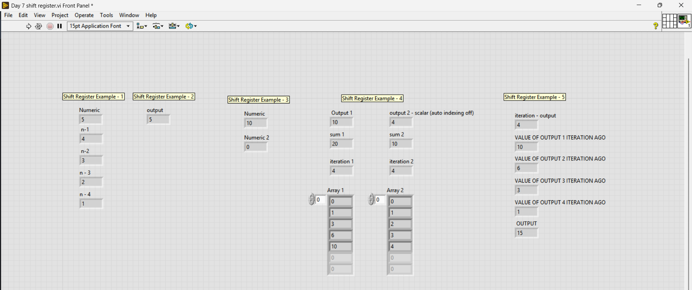 | 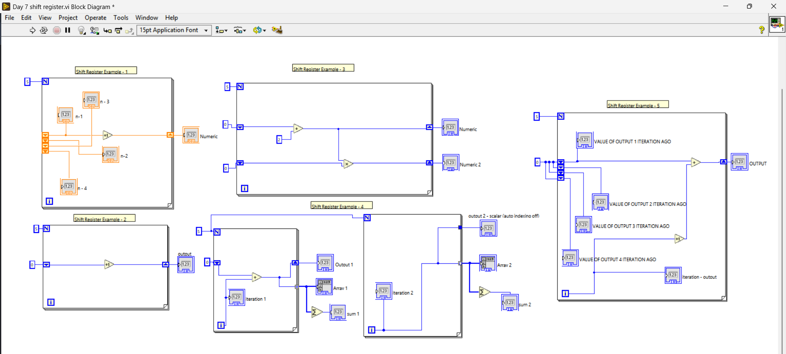 |

| Real-Time Sequential Accumulator | Stacked Historical Smoothing Filter | Multi-Point Seeded Sequence Matrix |
| :---: | :---: | :---: |
| 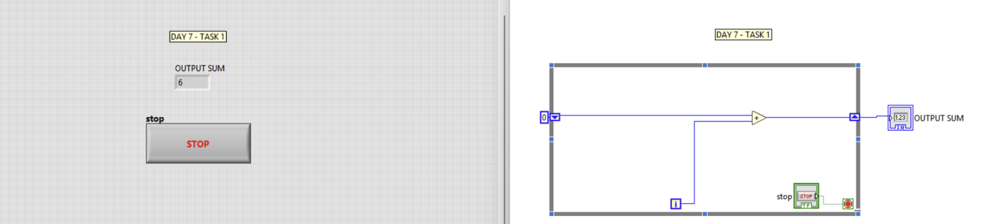 | 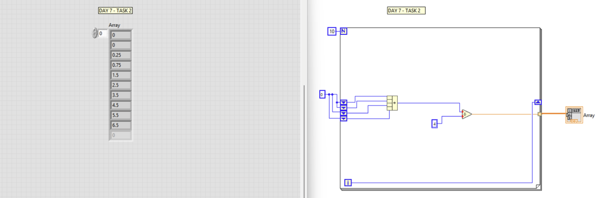 | 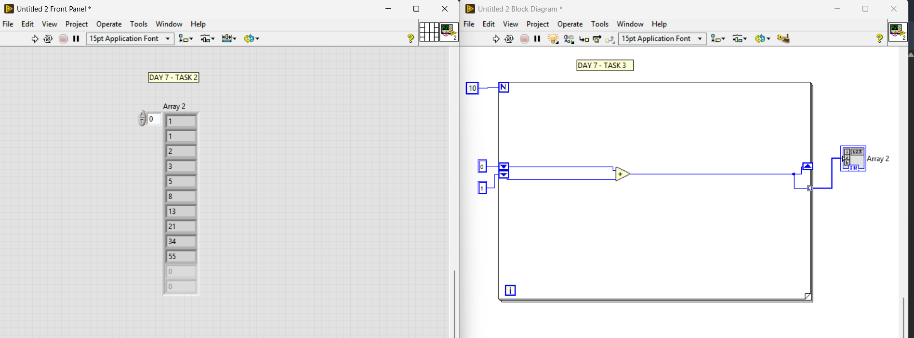 |

---

## 📁 Day 8: Dynamic Nested Alphanumeric Layouts & Character Conversions

### 🚀 Alphanumeric Data Casts, Nested Scaling Loops & Symmetrical Hourglass Syntheses
* **Objective:** Master nested loop parameter binding, integer-to-character ASCII type conversions, and dynamic user parameter configuration to assemble scalable alphanumeric hourglass layout patterns.

#### Detailed Architectural Implementations & Technical Milestones:

1. **Dual-Trunk Symmetrical Loop Mapping (Task [E] & [M]):**
   * Configured an upper shrinking-width loop subsystem paired with a lower growing-width loop subsystem to compile a multi-axis inverted character pyramid structure ($ABCDEFG \rightarrow A \rightarrow ABCDEFG$).
   * Utilized individual loop execution border tunnels to capture horizontal row packages and stack them sequentially into a multi-line array matrix format, establishing an inverse pyramid sequence with no dead rows or blank line gaps.

2. **Dynamic Front-Panel Parameter Sizing (Task [H]):**
   * Bypassed all hardcoded loop count constants by wiring interactive user controls ($x$ and $x\ 2$) directly into the matrix calculation blocks.
   * Proved that varying front-panel numeric inputs dynamically re-scales the internal loop boundary dimensions, allowing real-time modification of the character matrix limits up to any requested array length.

3. **Unified Terminal Display Optimization:**
   * Integrated an **Array To Spreadsheet String** node to flatten complex multi-line text arrays into a single string interface element.
   * Configured an **End of Line (EOL) Carriage Return** constant into the block's delimiter pin to strip out spreadsheet block containers, producing a clean cascading visual text layout directly on the console display panel.

#### Verified Implementation Workspaces:

| Theme-Oriented Front Panel Dashboard Console | Backend Block Diagram Multi-Bus Pipelines |
| :---: | :---: |
| 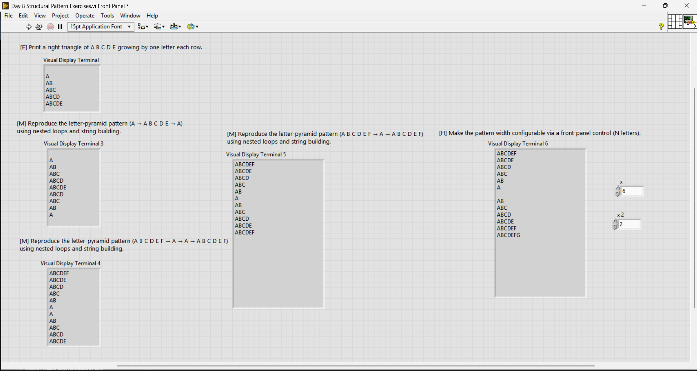 | 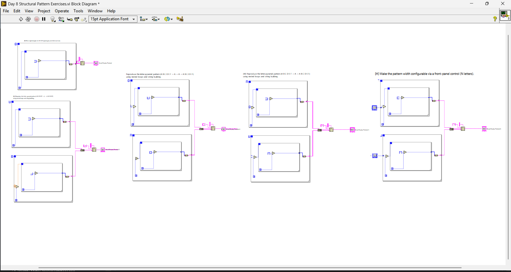 |

---

## 📁 Day 9: Character Loop Matrices & String Formatting

### 🚀 Star Triangle Generation, Array Concatenation & Centered Pyramids
* **Objective:** Master loop boundary behaviors, text string conversions, and dynamic padding logic to assemble scalable geometric star pattern matrices.

#### Detailed Architectural Implementations & Technical Milestones:

1. **Automated Array Accumulation & Left-Aligned Triangles (Task [E]):**
   * Configured a dynamic nested loop structure using an increment offset ($i + 1$) to drive inner loop execution parameters.
   * Automated row-width scaling to assemble a clean, left-aligned 5-row star triangle without manual index pointers.

2. **Symmetrical Array Concatenation & Diamonds (Task [M]):**
   * Combined an upper expanding loop engine ($i + 1$) and a lower contracting loop engine ($5 - i$) to form a mirrored star diamond pattern ($1 \rightarrow 5 \rightarrow 1$).
   * Programmed a **Build Array** node in **Concatenate Inputs** mode to append the two data channels back-to-back, preventing dimensionality breaks and eliminating index metadata text errors (`[]`).

3. **Centered Visual Alignment & Space Padding (Task [H]):**
   * Designed a centered star pyramid using an external front-panel control ($Pyramid\ Height\ (H)$) to resize loop limits dynamically at runtime.
   * Implemented dual-track string multiplier math inside the execution frame to calculate precise line spacing and star growth:
     * *Leading Spaces:* Approximated by the formula $H - 1 - i$ to add decreasing margins as the row count goes down.
     * *Center Stars:* Approximated by the odd-number formula $2i + 1$ to expand star widths symmetrically ($1, 3, 5, 7, 9$).

#### Verified Implementation Workspaces:

| Task [E]: Left-Aligned Star Triangle | Task [M]: Symmetrical Star Diamond | Task [H]: Centered Star Pyramid |
| :---: | :---: | :---: |
| 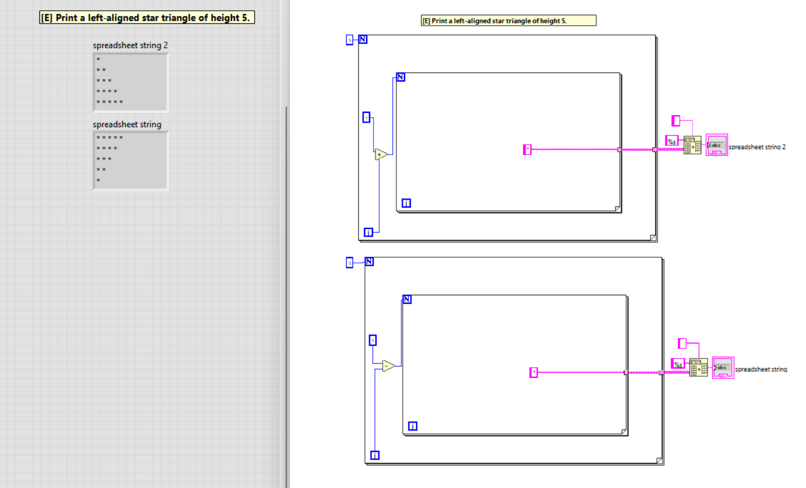 | 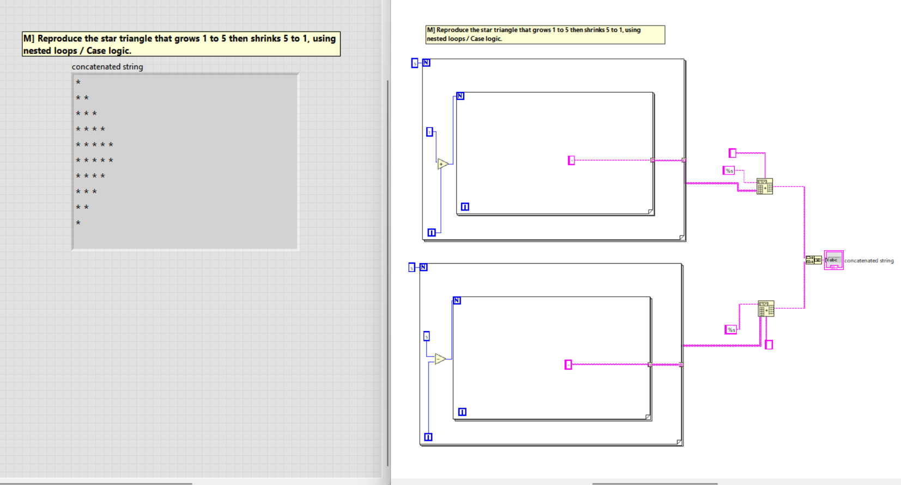 | 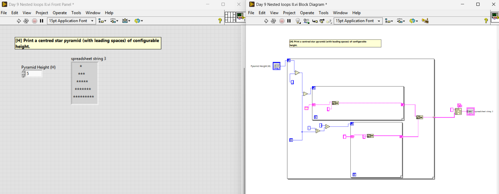 |
